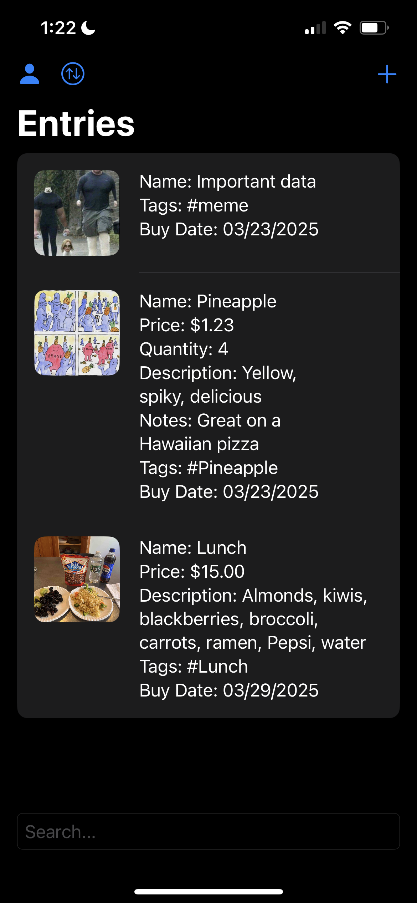
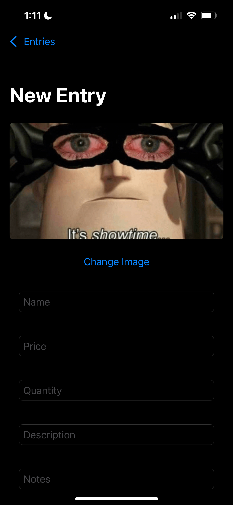
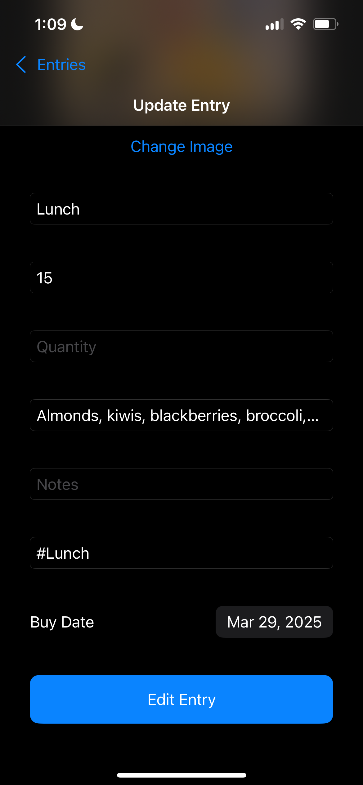
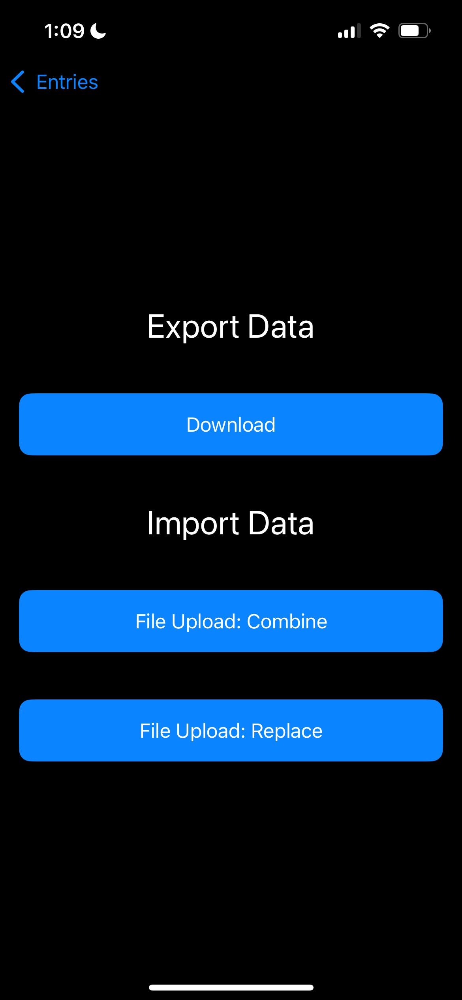
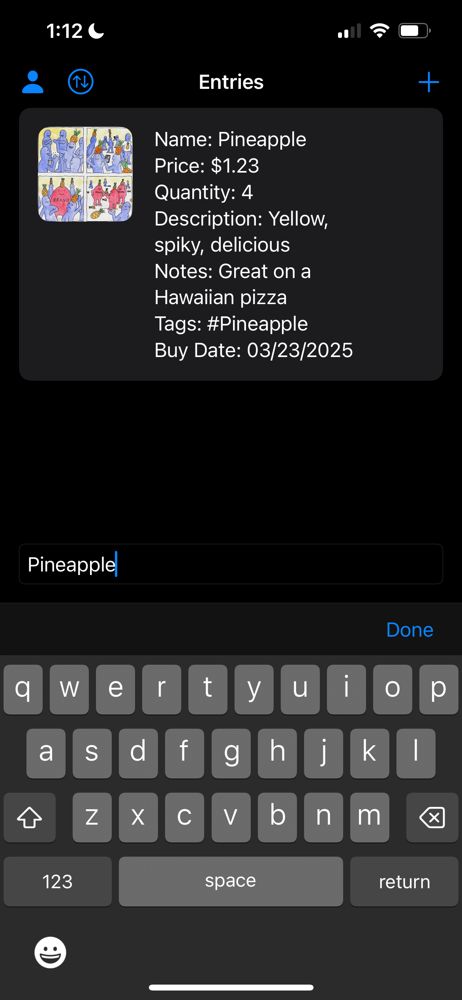
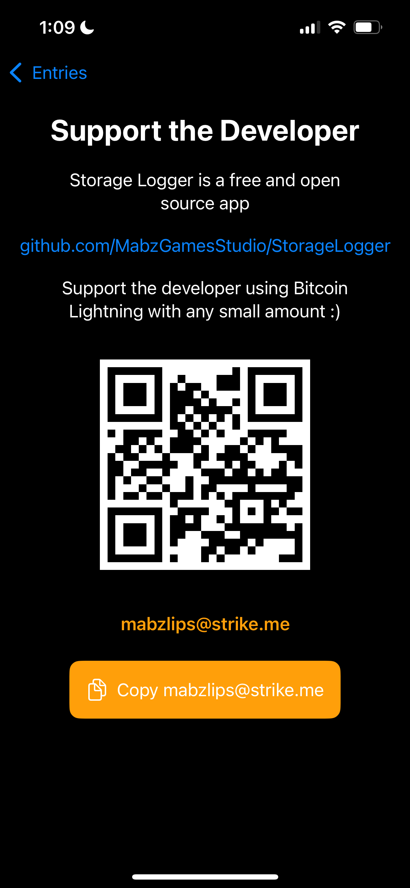

# Storage Logger


StorageLogger is a free and open-source app designed to help you log and track your stored items efficiently. It supports compressed image storage, tagging, pricing, quantifying. Useful for managing inventories, collections, or personal storage needs.

<p align="center">
  
</p>

## Features
- Add images to your entries
- Label name, price, quantity, description, notes, tags, and purchase date
- Manually sync items (download and upload files on device)

<p align="center">
  
  
  
  
  
  
</p>

## Getting Started

### Developer Tools
- Xcode 16.2
- Swift 6.0.3

### Installation
1. **Clone the repository:**
   ```sh
   git clone https://github.com/MabzGamesStudio/StorageLogger.git
   cd StorageLogger
   ```
2. **Open in Xcode:**
   ```sh
   open StorageLogger.xcodeproj
   ```
3. **Resolve dependencies:**
   - If using **Swift Package Manager (SPM)**, open Xcode and navigate to:
     `File` → `Packages` → `Resolve Package Versions`
   - If using **CocoaPods**, run:
     ```sh
     pod install
     ```

## Project Structure
```
StorageLogger
├── Models         # Entry, data model
├── Views          # Entries list view, single entry view, sync data view, and support developer view
├── ViewModels     # Entry, data store, and ad
├── Services       # Manual device file sync
├── Utilities      # Helper functions
├── Frameworks     # Google ad dependencies
```

## Contributing
As of now, I am a single developer casually maintaining this app, so will be slow to respond to change requests. But, this project uses an MIT licesnse, so feel free to learn from it, fork it, or make it better.

## License
StorageLogger is licensed under the [MIT License](LICENSE).

## Support the Developer
StorageLogger is free and open source. If you find it useful, consider supporting the developer using **Bitcoin Lightning**:

```
mabzlips@strike.me
```
